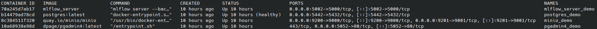

<!-- <p align="center">
  
</p> -->

<h1 align="center">
  Yi-Kai's AI/ML New York Stock Exchange <b>Demo</b><br>
  </h1>

<p align="center"> 
  <a href="/experiments/Readme.md">Experiments Play Zone 🛝 </a> •
  <a href="/production/Readme.md">Production ⛑️ 🏭</a> •
  <a href="/README.md">Main Page 🏠
</a><br> 
</p>


Hello, 

Welcome to the **Demo** zone! We will demonstrate how to use the docker + MLflow for a single AAPL stock prediction and publish the result in an interactive webpage   

## Update log:  
- 2025-11-22: initial version


## Steps 

1. Make sure you have [Docker and the environment](/README.md) set up properly. I will use the `dsi_participant` environment as an example here. Feel free to use any appropriate environment.

2. Start Docker and activate your environment in the terminal:   

```bash
cd /path/to/ML3-Team-Project/demo
conda activate dsi_participant  # activate environment 
docker compose -f docker-compose-demo.yml up -d compose up docker 
docker ps # should show the list of running containers.
```  
3. If everything passes, you should be able to see the terminal out like [this](/demo/images/demo_docker.png).

<!--  -->


3. Run the following to test Docker + MLflow
```bash
python test.py # this test mlflow.log_param and mlflow.log_metric functions 
python test_mlflow.py # test mlflow with a simple logistic regression 
```

If both are passed, you should see 