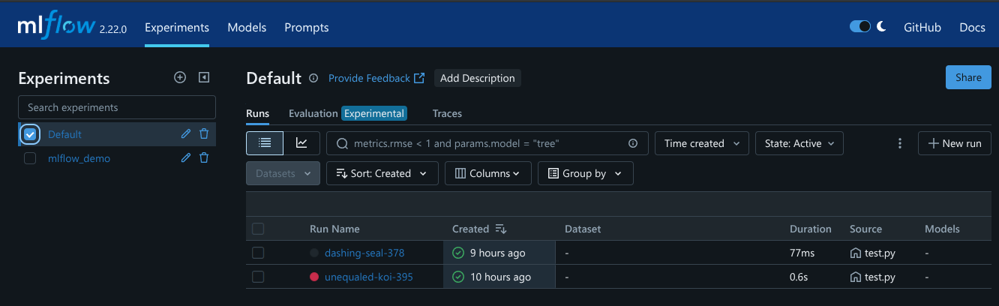
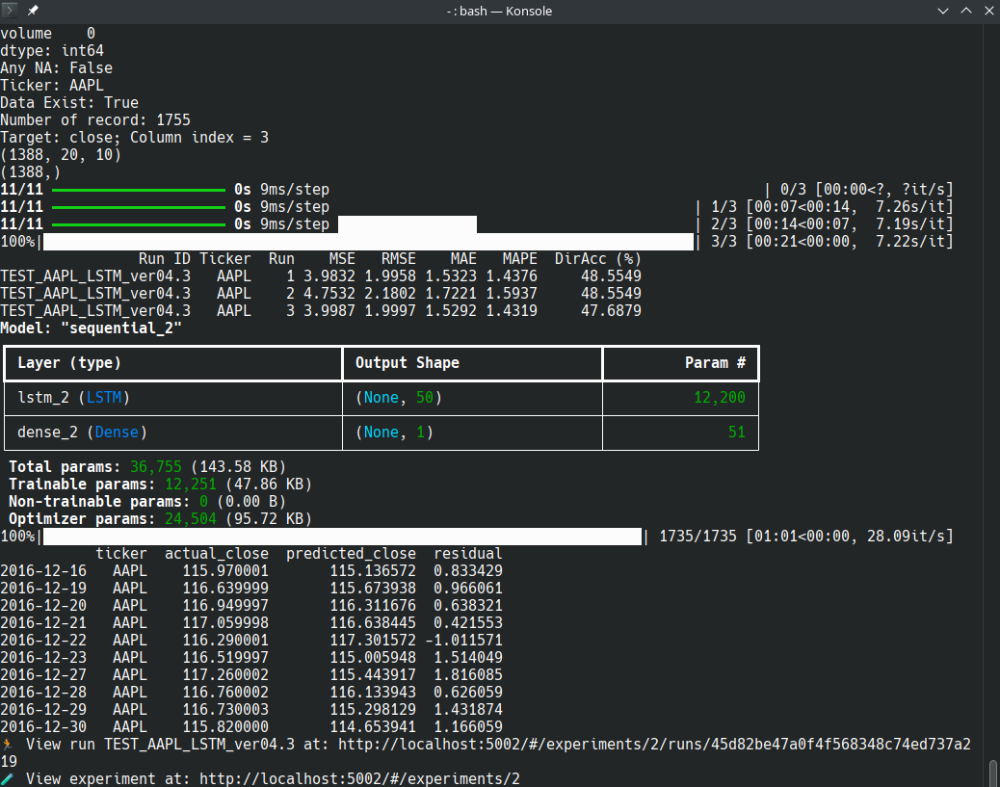

<!-- <p align="center">
  
</p> -->

<h1 align="center">
  Yi-Kai's AI/ML New York Stock Exchange Demo Zone<br>
  </h1>

<p><h4 align="center"> 
  <a href="/experiments/Readme.md">Experiments Play Zone 🛝 </a> •
  <a href="/production/Readme.md">Production ⛑️ 🏭</a> •
  <a href="/README.md">Main Page 🏠</a><br> 
  </h4>
  </p>


Hello, 

Welcome to the **Demo** zone! We will demonstrate how to use the Docker + MLflow for a single AAPL stock prediction and publish the result as an [interactive webpage](https://nysx-lstm-aapl.netlify.app/). You can also try other [tickers](/production/ticker.csv) if you wish.    

## Update Log:  
- 2025-11-22: initial version

- ⚠️ Known issues: The current demo script cannot log artifacts, as doing so will cause MLflow to hang. Logging parameters or metrics works fine. There is no issue in production, since the demo and production Docker setups are independently.  


## Steps 

1. Make sure you have [Docker and the environment](/README.md) set up properly. I will use the `dsi_participant` environment as an example here. Feel free to use any appropriate environment.

2. Start Docker and activate your environment in the terminal:   

    ```bash
    cd /path/to/ML3-Team-Project/demo
    conda activate dsi_participant  # activate environment 
    docker compose -f docker-compose-demo.yml up -d # compose up docker 
    docker ps # should show the list of running containers.
    ```  
3. If everything passes, you should be able to see the terminal out like [this](/demo/images/demo_docker.png).

4. Run the following to test Docker + MLflow

    ```bash
    python test.py # this test mlflow.log_param and mlflow.log_metric functions 
    python test_mlflow.py # test mlflow with a simple logistic regression 
    ```

    If both are passed, you should be able to open link (http://localhost:5002/#/experiments/0) and (http://localhost:5002/#/experiments/1) and see something like this: 

<br>   


<sub>[↥ back to top](#content)&emsp;|&emsp;[Return Main Page 🏠](/README.md) </sub>  

---
5. Inspect `demo_LSTM_v04.3.py` and Run it

    - Open `demo_LSTM_v04.3.py` in any command line editor or VScode, and review the paths if you want to modify anything. The followings are just a few examples of editable paths: 
        - `exp_name = "NYSX_LSTM_demo"`
        - `output_PATH = "./output"`
        - `output_PATH = "./output"` (inside the for loop)
        - `model_PATH = "./output"`
        - `RUN_NAME = f"TEST_{Tick}_LSTM_ver04.3"`
        - `FILE_PATH = "/../data/raw"`
        - `fig.write_html(f"{output_PATH}/{Tick}_filename.html")`
        - `fig.write_image(f"{output_PATH}/{Tick}_filename.html")`
        - `model_lstm.save(f"{output_PATH}/{Tick}_lstm_model.keras")`

    👉 Highly recommended: use **Ctrl + F** and search for keyword such as "save" or "write", etc.

    - After that, run the script in the terminal:  

    ```bash
    python demo_LSTM_v04.3.py
    ```

    - You should see it run successfully in the terminal, and you can access the result at: http://localhost:5002/#/experiments/2 

    <br>   
    
    <br>   
     
6. Publish your AAPL actual and prediction plot as an [interactive HTML](https://nysx-lstm-aapl.netlify.app/) using [**Netlify**](https://app.netlify.com/). This is the easiest way to share your Interactive Actual vs Prediction plot on internet
    - **Requirement**: an exported HTML using plotly and an email account to register for Netlify
    - Just following the steps below for a simple drag-and-drop:

      (1) Create a new folder named [Demo_AAPL](/demo/Demo_AAPL/), you can give other name if you like.  
      (2) Copy the `AAPL_actual_vs_predicted.html` into the folder you just created and rename it to `index.html`.  
      (3) Drop the folder that contains an index.html file into the “Deploy manually” area on Netlify. Wait for it to publish. Once it finishes, you’ll see a public link pointing to the index.html you uploaded.
      (4) Follow the additional steps on the site if you want more advanced configuration options.


7. Try other [tickers](/production/ticker.csv) if you want.

8. Stop and Shutdown Docker

    ```bash
    docker compose -f docker-compose-demo.yml stop # Stop the container
    docker compose -f docker-compose-demo.yml down -v # Delete all the volumne 
    ```

    ⚠️ `docker compose down -v` will delete all container volumes and reset everything to a clean state. ONLY Use this if there is no real production or important data you would like to keep.


