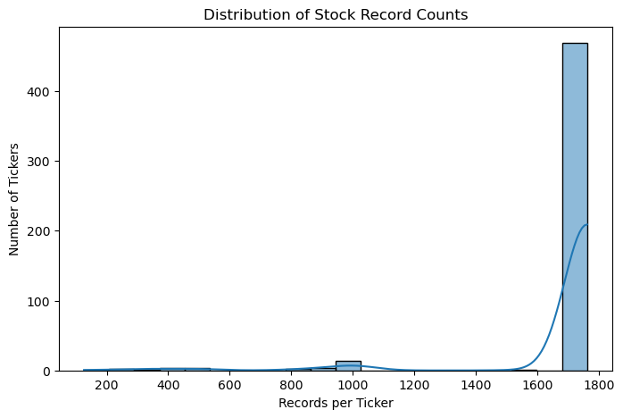
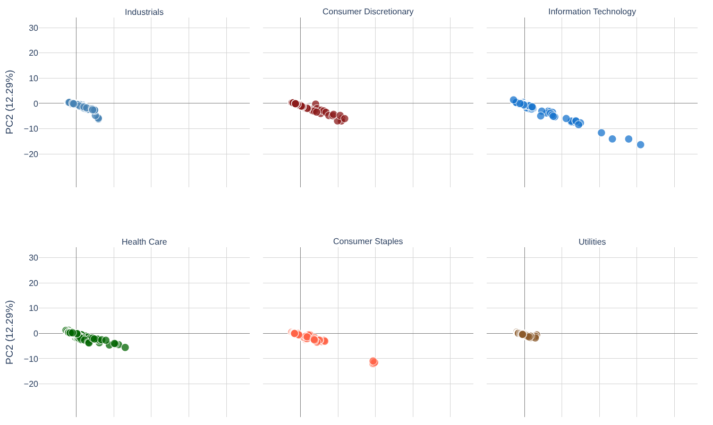
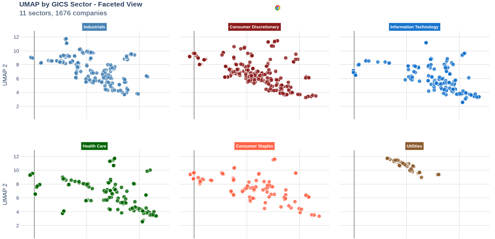

<!-- insert image  -->
<!-- <p align="center">
  
</p> -->

<p>
<h1 align="center">
  Capstone Project<br>
  NYSX Stock Price Prediction: Results and Findings 
  </h1>
  </P>

<!-- > [!IMPORTANT]  
> <p><i><h4 align="center">Align Center </h4></p>  
> <p><h5 align="right"> Align Right</h5></i></p>
>
 

> [!WARNING]  
> 1. 
>  -->
  
<p><h4 align="center">
** Continue Reading 👇**<br>
</p>

---
<h4 align="center"> 
  <a href="/data/Readme.md">Data</a> •
  <a href="/experiments/Readme.md">Experiments Play Zone 🛝 </a> •
  <a href="/demo/Readme.md">Demo</a> •
  <a href="/production/Readme.md">Production 🏭 </a> •
  <a href="https://nysx-interactive-f35996.netlify.app/">Interactive Plots 🔍 📈 </a> • 
  <a href="/README.md">Main Page 🏠</a>
  </h4>
<br>


## Content

* [1. Raw Data Inspection and Clean-Up](#1-raw-data-inspection-and-clean-up)
  - [Common functions](#common-functions)     
* [2. PCA and UMAP]()
* [3. LSTM modeling](#)
* [4.](#)  


## 1. Raw Data Inspection and Clean-up

The [New York Stock Exchange data set](https://www.kaggle.com/datasets/dgawlik/nyse) contains four files: fundamenrtals.csv, price-split-adjusted, price.csv, and security. We are only to look at **fundametnals.csv**, **price-split-adjusted.csv**, and **securities.csv**. Please read [here](/data/Readme.md) for more information. 

**Quick Summary**: From the 501 tickers, 470 (93%) of those have more than 1500 records. From those 470 companies, only 420 (89.4%) have corresponding fundamentals data. Most data are clean despite a few empty data from fundamentals.csv and securities.csv. No additional data cleaning is required 

- **fundametnals.csv**:  1781 rows × 79 columns.
    - Columns: Contains company-level financial indicators such as revenue, earnings, assets, liabilities, ratios, etc. with a total of 79 columns. For details, see [here](/data/Readme.md)
    - Number of Ticker: 505
    - Has NA: True; Has INF: False; Contains empty cells
    - Need to drop empty cells for PCA or UMAP 


- **price-split-adjusted.csv**: 851264 rows × 7 columns.   
    - Columns: 'date', 'symbol', 'open', 'close', 'low', 'high', 'volume'.
    - Total Ticker :501; Ticker with > 1500 records :470
    - No NA or empty cells 
    - Histogram: some tickers have much less data
    - cut-off: > 1500 records.  
    - Ticker with > 1500 records :470

    <br>
    <p>      
    <b>Fig. 1 Histogram of the number of records per ticker.</b>


- **securities.csv**: 505 rows × 8 columns.
    - Columns: 'Ticker symbol', 'Security', 'SEC filings', 'GICS Sector','GICS Sub Industry', 'Address of Headquarters', 'Date first added', 'CIK'.
    - Number of Ticker: 505
    - Has NA: True; Has INF: False; Contains empty cells but no impacts.
    - **Use the “GICS Sector” and “GICS Sub Industry” columns to map tickers**.


<sub>[↥ back to top](#content)&emsp;|&emsp;[Return Main Page 🏠](/README.md) </sub>  

---

### Common functions

1. `parse_date = ["date"]`: Tells pandas to look at the column named "date", detect its format (e.g., 2020-01-05, 01/05/2020, etc.), and convert it into a datetime64[ns] type.
    ```python
    ## parse_date 
    df = pd.read_csv("../../data/raw/prices-split-adjusted.csv", parse_dates=["date"]) 
    ```

2. Check if a data frame (df) contains any NA or INF
    ```python
    df = pd.read_csv("cd path/to/the/data", parse_dates=["date"])
    display(df)

    ## check for NA nad INF before removing it
    has_nan = df.isna().any().any()

    # check if has any INF
    numeric_cols = df.select_dtypes(include=[np.number])
    has_inf = numeric_cols.isin([np.inf, -np.inf]).any().any()
    print("File: "file_name.csv")
    print(f"Has NA: {has_nan}")  
    print(f"Has INF: {has_inf}") 
    ```
<sub>[↥ back to top](#content)&emsp;|&emsp;[Return Main Page 🏠](/README.md) </sub>  

---

## 2. PCA and UMAP

PCA stands for **Principal Component Analysis** while UMAP stands for **Uniform Manifold Approximation and Projection**. Both are very powerful tools for clustering and similarity analysis to explore relationships among sectors or subsectors of interest.

Here, we employed PCA and UMAP to identify similar stock allowing us for applying the grouping strategy. This will pave the path to identify stocks with higher similarity to be grouped together for model training. The table below summarize the pros and cons among PCA, UMAP, and t-SNE


| Feature / Property                | **PCA**                                        | **UMAP**                                  | **t-SNE**                       |
| --------------------------------- | ---------------------------------------------- | ------------------------------------------| --------------------------------|
| **Type**                          | Linear projection                              | Nonlinear manifold learning               | Nonlinear manifold learning     |
| **Captures nonlinear structure?** | ✘ No                                           | ✔ Excellent                              | ✔ Very good                    |
| **Preserves local structure?**    | ▲ Moderate                                     | ✔ Strong                                 | ✔ Very strong                  |
| **Preserves global structure?**   | ▲ Moderate                                     | ✔ Better than t-SNE                      | ✘ Weak                          |
| **Scalability**                   | ✔ Very fast                                   | ✔ Fast on large datasets                 | ✘ Slow on large datasets        |
| **Distance metrics**              | Mostly Euclidean                               | ✔ Many (Euclidean, cosine, correlation…) | Mostly Euclidean                |
| **Output stability**              | ✔ Highly stable                               | ▲ Reasonably stable                       | ✘ Often variable between runs   |
| **Ideal output dimension**        | Any                                            | 2–50                                      | Best for 2–3                    |
| **Typical use**                   | Preprocessing, linear dimensionality reduction | Visualization, clustering, embeddings     | Visualization of dense clusters |
| **Parameter sensitivity**         | ✔ Low                                         | ▲ Medium                                  | ✘ High                          |
| **Computational cost**            | Low                                            | Medium                                    | High                            |
| **Cluster separation**            | ▲ Weak                                         | ✔ Good                                   | ✔ Very good, but exaggerated   |

<br>
There are many different ways to explore these interactive plots. Due to time constraints, we only focused on subsectors from Information Technology (IT) and Utilities here. The IT sector exhibits a wider spread, while the Utilities sector has a much tighter distribution, making them a good starting point to assess whether PCA is providing meaningful separation. Additionally, we already used AAPL, INTC, and MSFT as our base models for LSTM, all of which belong to the IT sector. Later, we also used PCA-reduced UMAP as an additional evaluation tool to further assess the findings from PCA. See **Fig. 2** and **Fig. 3** below. Similar cluster patterns were observed from PCA and UMAP. 


<br>
  
  
**Fig. 2. PCA Analysis by Selected Sector – Faceted View**. For the complete plot, see [here](https://nysx-interactive-f35996.netlify.app/test10/pca_by_sector_test10)

<br>
     

**Fig. 3. UMAP Analysis by Selected Sector – Faceted View**. For the complete plot, see [here](https://nysx-interactive-f35996.netlify.app/test10/umap_by_sectors_pca_faceted_reduced(n=20)_test10)

<br>

Finally, we used AAPL, INTC, and MSFT as our first trial to assess the model's performance by training an LSTM on three tickers simultaneously. Since they don't share the same PCA space (**Fig. 4**), this approach can be considered a worst-case scenario. Later, to answer whether PCA can provide insight into how to group similar stocks, we selected the tickers showing similar clusters to train the LSTM. These included the semiconductor equipment subsector (**MAT**, **KLAC**, **LRCX**) of the IT sector (**Fig. 5**) and three tickers (**WEC**, **LNT**, **AWK**) from the Utilities subsector (**Fig. 6**).

<br>  
      

**Fig. 4. PCA with the IT subsector containing AAPL, INTC, and MSFT**. For the complete plot, see [here](https://nysx-interactive-f35996.netlify.app/test11/it_subsector_pca_faceted_test11)        

<br>  
  

**Fig. 5. PCA with the IT subsector Semiconductor Equipment shows the similarities among MAT, KLAC and LRCX when plotted along PC1 and PC2.** For the complete plot, see [here](https://nysx-interactive-f35996.netlify.app/test11/it_subsector_pca_faceted_test11)        

<br>  
  

**Fig. 6. PCA Analysis with the Utilities subsector shows the similarities among LNT, WEC and AWK when plotted along PC1 and PC2.** For the complete plot, see [here](https://nysx-interactive-f35996.netlify.app/test14/util_subsector_pca_faceted_test14)   

<br>

👉 For more details on the PCA and UMAP analyses, please see experiments [test 10](/experiments/NYSX_test10_sectors_PCA_UMAP.ipynb), [test 11](/experiments/NYSX_test11_subsector_tech_PCA.ipynb), and [test 14](/experiments/NYSX_test14_subsector_utils_PCA.ipynb). 

👉 Check here to see the [interactive plot 🔍 📈](https://nysx-interactive-f35996.netlify.app/)


<br>
<sub>[↥ back to top](#content)&emsp;|&emsp;[Return Main Page 🏠](/README.md) </sub>  

---

## 3. LSTM Model 


### Prediction on single stock
Coming soon...


### Prediction with multiple stock
Coming soon...

### Time Requirement
Coming soon...


<sub>[↥ back to top](#content)&emsp;|&emsp;[Return Main Page 🏠](/README.md) </sub> 

---

## Take Away
Coming soon...


